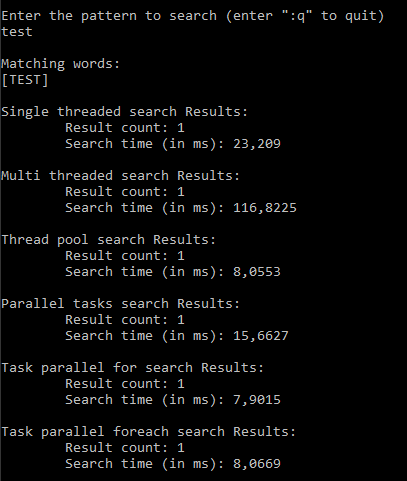
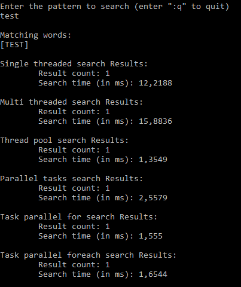
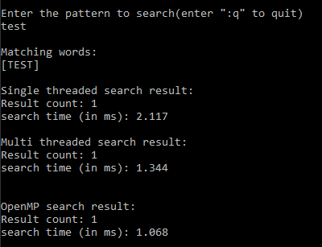
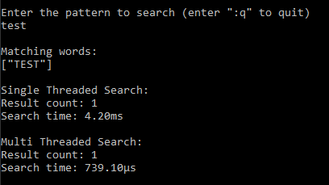

# word-finder

The exercise here is to implement a test client that accepts a search string, perform a search in a given list of words and return every words of the list that starts with the search string and print the resulting words and the search time.

The algorithm shall make use of the multi-core CPU for distributing the search on several cores.

For demonstration purpose the word list consists of all possible combination of 4 upper cas letters (AAAA to ZZZZ) in a random order.

## C# implementation

The fist thing is to generate to list in which the search will be performed.

Generating the word list simply consists on 4 loops that loop from 'A' to 'Z' character and add the concatenation of the 4 characters to the word list, once it's done we shuffle the list so the words appear in random order:

```csharp
for (char c1 = 'A'; c1 <= 'Z'; c1++)
{
    for (char c2 = 'A'; c2 <= 'Z'; c2++)
    {
        for (char c3 = 'A'; c3 <= 'Z'; c3++)
        {
            for (char c4 = 'A'; c4 <= 'Z'; c4++)
            {
                WordList.Add("" + c1 + c2 + c3 + c4);
            }
        }
    }
}
WordList.Shuffle();
```

For comparison purpose next thing is to perform the search on a single thread.

On single thread the search basically consist of a for loop that iter over every word of the list and to test if the word start with the input pattern:

```csharp
public List<string> SearchSingleThreaded(List<string> wordList, string pattern)
{
    List<string> matchingWords = new List<string>();

    foreach (string word in wordList)
    {
        if (StartsWith(word, pattern))
        {
            matchingWords.Add(word);
        }
    }

    return matchingWords;
}
```

Next step is to perform the search on multiple threads. To do that a simple approach is to make each thread itern over N words or the list without aving multiple thread checking the same word.

First we need to know how many thread the processor has:

```csharp
maxThreads = Environment.ProcessorCount;
```

Second, we set the nurber of words that each thread is going to handle:

```csharp
chunckSize = wordList.Count / maxThreads;
```

Next we declare a ConcurrentBag that is going to contains the result. The ConcurrentBag handle by himself concurrent access without having to manually use mutex.

```csharp
ConcurrentBag<string> matchingWords = new ConcurrentBag<string>();
```

After that we nedd to declare the function that each thread will perform:

```csharp
ParameterizedThreadStart parameterizedThreadStart = new ParameterizedThreadStart(
x =>
{
    int index = Convert.ToInt32(x);
    if (index == -1) return;

    for (int i = index * chunckSize; i < (index + 1) * chunckSize; i++)
    {
        if (StartsWith(wordList[i], pattern))
        {
            matchingWords.Add(wordList[i]);
        }
    }
})
```

Then we just need to give the callback to each of our threads and start them:

```csharp
for (int i = 0; i < maxThreads; i++)
{
    threads.Add(new Thread(parameterizedThreadStart));
    threads[i].Start(numberList[i]);
}
```

Here numberList is just a list of integer where numberList[i] = i, this is to be sure that each thread will receive the good index number.

As "chunckSize = wordList.Count / maxThreads;" can be a decimal number that is going to be floor, the main thread need to perform the test of the few element that the threads will miss.

```csharp
for (int i = chunckSize * maxThreads; i < wordList.Count; i++)
{
    if (wordList[i].StartsWith(pattern))
    {
        matchingWords.Add(wordList[i]);
    }
}
```

Then we wait that all threads finish their tasks and return the final result:

```csharp
foreach (Thread thread in threads)
{
    thread.Join();
}

return matchingWords.ToList();
```

### Other implementations

With the same logic, I do multiple implementation without manually managing threads:

- using ThreadPool.

- using Parallel Task Library Parallel.For function.

- using Parallel Task Library Parallel.ForEach function.

- using tasks launched from the factory.

Using Parallel Tast Library is much more simple as the implementation is almost the same for the single threaded one:

```csharp
public List<string> SearchTaskParallelForEach(List<string> wordList, string pattern)
{
    ConcurrentBag<string> matchingWords = new ConcurrentBag<string>();

    Parallel.ForEach(wordList, word =>
    {
        if (StartsWith(word, pattern))
        {
            matchingWords.Add(word);
        }
    });

    return matchingWords.ToList();
}
```

For the last one, as Task<T> can return a value, each Task create is own list of matching words and return it, then when the task is finish the main thread concatanates resulting list of each task before returning the final list of matching words.

### Measurements of search time for each implementations

Measurements was made on an Intel(R) Core(TM) i7-8700K CPU @ 3.70GHz 6Core 12 Threads.

<div>

</div>

To shorten the search time, we can to one simple thing. As the C# method string.StartsWith() is quite slow, we can implement our own as follow:

```csharp
private bool StartsWith(string word, string pattern)
{
    if (pattern.Length > word.Length) return false;
    for (int i = 0; i < pattern.Length; i++)
    {
        if (word[i] != pattern[i]) return false;
    }
    return true;
}
```

With just this simple change, here's the new measurements: 

<div>

</div>

## C++ implementation

Here the implementation is the same as for C#

We generate our word list and shuffle it:

```cpp
vector<string> generateWordList()
{
    vector<string> wordList;
    for (char c1 = 'A'; c1 <= 'Z'; c1++)
    {
        for (char c2 = 'A'; c2 <= 'Z'; c2++)
        {
            for (char c3 = 'A'; c3 <= 'Z'; c3++)
            {
                for (char c4 = 'A'; c4 <= 'Z'; c4++)
                {
                    wordList.push_back(string({ c1, c2, c3, c4 }));
                }
            }
        }
    }
    auto rng = default_random_engine{};
    std::shuffle(wordList.begin(), wordList.end(), rng);
    return wordList;
}
```

Get the max number of threads:

```cpp
maxThreads = thread::hardware_concurrency();
```

And for the search we do exactly the same:

- Determine the number of word that each thread will process.

- Define the callback for threads.

- Instantiate thread and passing them the callback function.

- Procees the few words left (if there is any) du to chunck size imprecision.

- Wait for threads to finish.

- Return the list of words that match the given pattern.

Here's the implementation of the search function:

```cpp
vector<string> processSearchMultiThreaded(const vector<string>& wordList, const string& pattern)
{
    int chunckSize = wordList.size() / maxThreads;
    vector<string> matchingWords;
    vector<thread> threads;

    auto process = [&chunckSize, &wordList, &pattern, &matchingWords](int index) {
        for (int i = index * chunckSize; i < (index + 1) * chunckSize; i++)
        {
            if (startsWith(wordList[i], pattern))
            {
                lock_guard<mutex> guard(matchingWordsMutex);
                matchingWords.push_back(wordList[i]);
            }
        }
    };

    for (int i = 0; i < maxThreads; i++)
    {
        threads.push_back(thread(process, numberVector[i]));
    }

    for (int i = maxThreads * chunckSize; i < wordList.size(); i++)
    {
        if (startsWith(wordList[i], pattern))
        {
            lock_guard<mutex> guard(matchingWordsMutex);
            matchingWords.push_back(wordList[i]);
        }
    }

    for (int i = 0; i < threads.size(); i++) 
    {
        threads[i].join();
    }

    return matchingWords;
}
```

Note here to secure concurrent access to the vector matching word, we have to use a mutex.

### Other implementation

C++ also have a library similar to the Task Parallel Library in C#, it is OpenMP:

Here's the same function using this library:

```cpp
vector<string> processSearchOpenMP(const vector<string>& wordList, const string& pattern)
{
    vector<string> matchingWords;

#pragma omp parallel for num_threads(maxThreads)
    for (int i = 0; i < wordList.size(); i ++)
    {
        if (startsWith(wordList[i], pattern))
        {
#pragma omp critical
            matchingWords.push_back(wordList[i]);
        }
    }
    return matchingWords;
}
```

### Measurements of search time for each implementations

Measurements was made on an Intel(R) Core(TM) i7-8700K CPU @ 3.70GHz 6Core 12 Threads.

<div>

</div>

## Rust implementation

As a little bonus I made the same thing in Rust as I've started to learn it.

The word list generation:

```rust
fn generate_word_list() -> Vec<String> {
    let mut res: Vec<String> = vec![];
    for c1 in 'A'..='Z' {
        for c2 in 'A'..='Z' {
            for c3 in 'A'..='Z' {
                for c4 in 'A'..='Z' {
                    res.push(format!("{}{}{}{}",c1,c2,c3,c4));
                }
            }
        }
    }
    res.shuffle(&mut thread_rng());
    res
}
```

the search is made with a package call rayon, it's similar to Task Parallel Library for C# and OpenMP for C++.

Here's the search function:

```rust
fn is_correct_word(word : &str, pattern : &str) -> bool {
    let len = pattern.len();
    match word.get(..len) {
        Some(sub_word) => sub_word == pattern,
        _ => false,
    }
}

fn process_search_multi_threaded<'a>(word_list: &'a Vec<String>, pattern: &'a str) -> Vec<&'a String> {
    let result: Vec<&String> = word_list.into_par_iter().filter(|word| is_correct_word(word, pattern)).collect();
    result
}
```

### Measurements of search time for each implementations

<div>

</div>


## Incremental search

If the task was to implement an incremental search (i.e. the search starts while typing the first letter), a possible solution is to keep the same logic but each time a new letter is added to the search:

- If the search for the previous letter is already done, search the new pattern not in the entire word list but in the previous letter search matching words list.

- If the search for the previous letter isn't finished, notify each theads with the new pattern to look for till the end of their search. Next to that we iter over the starting list of matching words to look for the pattern and remove the one who doesn't match the new pattern.


## Possible UI

A possible UI would be search bar, as the one of google for example:

<div>

</div>
